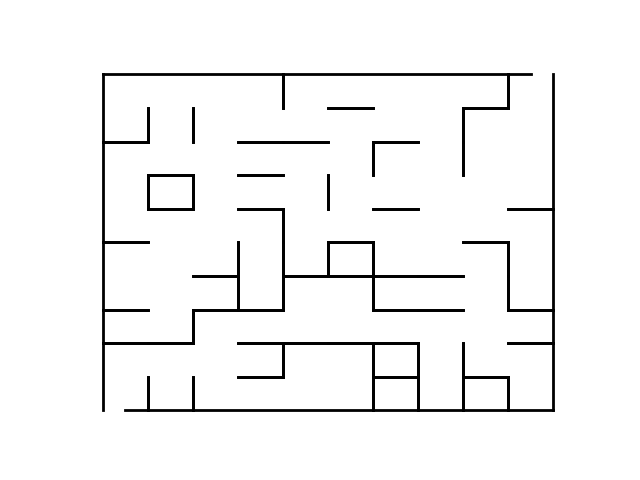

# Maze Generator

Generate a maze and save it as png/pdf file and a simple txt file. Each line in
the txt file has 4 points `x0 y0 x1 y1` that is a line from `(x0, y0)` to `(x1,
y1)`. You can draw your own line.

I don't this it is a good maze generator but it seems to be working fine. I
needed a quick and dirty way to generate a few maze to test other algorithms.

## How it works

- For a given grid size `(m, n)`, generates a graph `g` with `m×n` nodes. Add some
  random edges till there is a path from first node to the last node.
- Convert `g` to a maze. An edge between two nodes in `g` means that there is a
  path between these nodes. Disconnect neighboring nodes in the graph means wall
  in the maze. This is the critical step in this program.
- Massage the graph `g` a bit more making sure at least one solution exists in `g`. 

## Usage

See the `Makefile` for usage.

```
usage: maze.py [-h] [-s SHAPE] [--perfect] [-o OUTPUT] [-p PLOT] [-X]

Create maze

optional arguments:
  -h, --help            show this help message and exit
  -s SHAPE, --shape SHAPE
                        Gridsize of the maze as csv e.g. -s 20,20 or -s 10,10
  --perfect             Perfect maze?
  -o OUTPUT, --output OUTPUT
                        Save maze (as lines) to this path.
  -p PLOT, --plot PLOT  Save maze (as image) to this path.
  -X, --show-solution   If true, draw solution as well. Requires --plot to be
                        set.

```

## Examples

### 10x10 maze 



The lines that draws the mize are stored in `_maze.txt` file. Following command
generates this maze and the `_maze.txt` file.

`python3 maze.py -s 10,10 -o _maze.txt --plot _maze.png`

### 20x20 maze with a solution plotted.


Command to plot this maze.

`python3 maze.py -s 20,20 --show-solution --plot _maze_solution.png`
